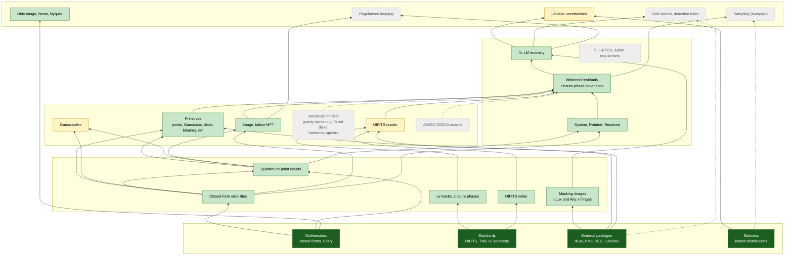

# Design: bootstrapping trust

virgil is largely written by language models (Claude and Copilot), and so are
most of its tests, which mostly check virgil against other parts of
virgil. That proves the code is self-consistent, not that it is right. A
sign convention, a factor of two or a misread paper can be consistent
everywhere and still wrong.

This repository's strategy is to **bootstrap trust**. We start from a few
things we do not need to take on faith, and extend trust upwards one checked
step at a time, until every capability of virgil hangs from that foundation
by a chain of independent checks.

## Principles

1. **Roots of trust are never LLM-written.** A root is one of:
    * **mathematics**: closed-form results (Fourier transforms of
      Gaussians and disks, the shift and convolution theorems, the Airy
      pattern), checked numerically with mature, human-written libraries
      (NumPy, SciPy's Cephes Bessel functions);
    * **standards**: published definitions (OIFITS v1 and v2, position
      angle North through East, Earth-rotation synthesis in Thompson,
      Moran & Swenson);
    * **mature external packages** written and used by people:
      [dLux](https://github.com/LouisDesdoigts/dLux),
      [PMOIRED](https://github.com/amerand/PMOIRED),
      [CANDID](https://github.com/amerand/CANDID);
    * **statistics**: ensembles of simulations whose distribution is known
      (pulls of fit − truth over σ must be N(0, 1)).
2. **Our own reference code is a link, not a root.** `crosscheck` is also
   LLM-written. Before it may judge virgil, each reference must agree with a
   root by a second, independent route (e.g. quadrature against a closed
   form), and it must never import or copy virgil.
3. **Trust flows upwards only.** A virgil capability is trusted when it is
   checked against something already trusted *and* everything it is built
   on is trusted. A fit is only as trustworthy as the likelihood, which is
   only as trustworthy as the model and the data reader.
4. **When roots disagree, mathematics wins.** If PMOIRED and virgil
   disagree, our analytic references decide which is wrong (as with
   PMOIRED's ring precision, [P3](pmoired_notes.md)).
5. **Disagreements are findings, never tolerances.** Each one is kept as a
   test (pinned behaviour plus a strict `xfail` for the fix), fixed in
   virgil by a PR, or reported upstream.
6. **People sign off the conventions.** Every mapping between conventions
   (axes, signs, which angle is which) is written down in a page a person
   can check, because a model can agree with itself about a convention.

## The flow

Solid boxes are trusted (checked against a root, with trusted inputs);
dashed boxes are not yet.



## Status

What is trusted now, and from which root. Details and numbers are in the
[report](report.md).

### Independent references

- [x] Closed-form visibilities agree with our quadrature (1e-15) (mathematics)
- [x] Earth-rotation uv tracks, closure phases (standards)
- [x] OIFITS writer: read correctly by both virgil and PMOIRED (standards, external)
- [x] Masking images: dLux and the closed-form interferogram agree (1e-5) (external, mathematics)

### virgil: models and data

- [x] `PointSource`, `GaussianDisk`, `EllipticalGaussian`, `UniformDisk`, binaries: 1e-15 (mathematics), 1e-12 against PMOIRED (external)
- [x] Random 24-component constellations: 1e-12 (mathematics, external)
- [x] `ModulatedGaussianRim`: 1e-16 (quadrature); zero-width limit of PMOIRED's annulus (external). Docstring finding 1.
- [ ] `GaussianArc`: ±3.5σ truncation (finding 2; fix in progress)
- [x] `Image` orientation and transforms; rotated-lattice MFT (1e-12)
- [x] `Rotated`, `Resolved`, nested `System`s
- [x] OIFITS reader on our files (5e-16)
- [ ] OIFITS reader on real instrument files (GRAVITY, PIONIER, MATISSE, NIRISS AMI), against PMOIRED's and CANDID's readers
- [ ] `GravityDarkenedStar`, flared disks, `HarmonixModel`
- [ ] Chromatic fluxes (`virgil.spectra`) and bandwidth smearing
- [ ] AMIGO DISCO mode bases

### virgil: composition, likelihood, fitting

- [x] Closure-phase whitening: pulls N(0, 1) with correlated noise (statistics)
- [x] LM fits recover injected truth to 1e-10 noise-free, 0.02σ bias from dLux masking data
- [ ] L-BFGS and Adam fits, regularisers
- [ ] Fits against PMOIRED and CANDID on identical files (plan Stage 2)

### virgil: inference products

- [x] Laplace uncertainties for scalar parameters calibrated (statistics)
- [ ] Laplace uncertainties with array-valued parameters (finding 5; fix in progress)
- [x] Dirty image, beam, Nyquist pixel, field of view, beam convolution (mathematics)
- [ ] Grid search and detection limits against CANDID (plan Stage 3)
- [ ] Sampling: simulation-based calibration of `numpyro_model` posteriors (statistics)
- [ ] Regularised imaging (RML, GP) against an external imager and recovery statistics

### People

- [ ] Conventions pages ([PMOIRED](pmoired_conventions.md); CANDID to come) checked by a person
- [ ] Findings reviewed and their fixes merged in virgil

## Building the flow

The chart and the checklist above are written by hand, which means they
will go stale. To make the flow real, so that it updates itself and catches
gaps, we would need the following.

### 1. A machine-readable trust graph

Tag every validation test with what it validates and what it rests on:

```python
@pytest.mark.validates("virgil.models.UniformDisk", root="mathematics")
@pytest.mark.validates("virgil.models.UniformDisk", root="pmoired")
def test_uniform_disk_through_nulls(...): ...
```

A small pytest plugin collects the tags and the test outcomes into
`trust.json`: for each virgil object, which roots it reaches, through which
tests, and whether they passed against the latest virgil. Edges between
virgil objects (a `System` is built from components; `fit` uses the
likelihood) go in one hand-written `dependencies.yml`, since they reflect
virgil's design, not tests.

### 2. Propagation

A script computes each node's status from `trust.json` and
`dependencies.yml`:

* **trusted**: at least one passing check against a root (two independent
  roots for anything a model could plausibly get wrong in a correlated way,
  such as conventions), and every dependency trusted;
* **partial**: checked, but a dependency is not trusted, or a check is an
  open finding (`xfail`);
* **untrusted**: no check.

It then writes the Mermaid chart and the checklist on this page, so the
status shown is always the status measured.

### 3. Coverage of virgil's public API

List virgil's public objects (its `__all__` and the API pages of its
documentation), and flag any without a node. The weekly CI run against
virgil's `main` updates a pinned Issue, "Untrusted in virgil", so a new
model or function cannot arrive without someone seeing that it is
unvalidated.

### 4. Pinned roots

Roots are only roots if they hold still: pin SciPy, dLux, PMOIRED and
CANDID versions (as `[external]` does for PMOIRED), record them on the
results page, and bump them only in deliberate PRs that rerun everything.

### 5. Guarding against common-mode errors

Our reference code shares an author type with virgil. Beyond the
two-routes rule for every reference:

* prefer an external package or a closed form over our own code wherever
  either exists, and use our code only to referee between them;
* keep `crosscheck` small and boring (direct sums, standard quadrature, no
  clever optimisation), so a person can review it in an afternoon;
* record which conventions pages a person has checked, and show unchecked
  ones as partial.

### 6. Filling the gaps, roots first

In dependency order, each with the root it would rest on:

| Gap | Root |
| --- | --- |
| OIFITS reader on real files | PMOIRED's and CANDID's readers on ESO archive data (GRAVITY, PIONIER, MATISSE) |
| `GaussianArc` (after the fix) | mathematics (full-circle quadrature) |
| Spectra, bandwidth smearing | mathematics (channel integrals of closed forms); PMOIRED's spectra |
| `GravityDarkenedStar` | the non-rotating limit (a limb-darkened disk, closed form); Shashank Dholakia's original code (golden values already in virgil) |
| `HarmonixModel` | harmonix/starry spherical-harmonic maps against direct surface quadrature |
| Flared disks | direct quadrature of the documented brightness distribution |
| Fits with other optimisers | statistics (pulls), PMOIRED's fits (plan Stage 2) |
| Grid search, detection limits | CANDID (plan Stage 3); injection-recovery detection rates (statistics) |
| Sampling | simulation-based calibration (rank statistics uniform) |
| AMIGO DISCO records | the AMIGO package's own forward model on a common scene |
| Regularised imaging | recovery statistics on simulated scenes; an external imager (e.g. MiRA or SQUEEZE) on the same files |

### 7. Order of work

1. The pytest tags and `trust.json` (a day).
2. Propagation and generating this page from it (a day).
3. The API coverage Issue (half a day).
4. Then the gaps in the table, roots first, each one a PR that turns a box
   from grey to green.

Related: virgil's own note on [matching PMOIRED's
features](https://github.com/benjaminpope/virgil/blob/main/design/pmoired_parity.md).
