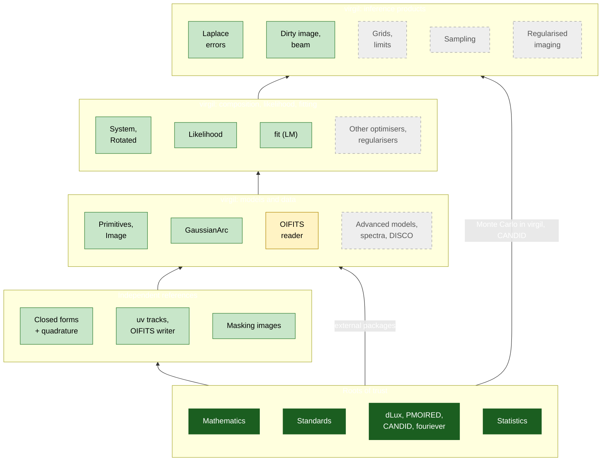

# Design: bootstrapping trust

virgil is largely written by language models (Claude and Copilot), and so are
most of its tests, which mostly check virgil against other parts of
virgil. That proves the code is self-consistent, not that it is right. A
sign convention, a factor of two or a misread paper can be consistent
everywhere and still wrong.

This repository's strategy is to **bootstrap trust**. We start from a few
things we do not need to take on faith, and extend trust upwards one checked
step at a time, until every capability of virgil hangs from that foundation
by a chain of independent checks.

## Principles

1. **Roots of trust are never LLM-written.** A root is one of:
    * **mathematics**: closed-form results (Fourier transforms of
      Gaussians and disks, the shift and convolution theorems, the Airy
      pattern), checked numerically with mature, human-written libraries
      (NumPy, SciPy's Cephes Bessel functions);
    * **standards**: published definitions (OIFITS v1 and v2, position
      angle North through East, Earth-rotation synthesis in Thompson,
      Moran & Swenson);
    * **mature external packages** written and used by people:
      [dLux](https://github.com/LouisDesdoigts/dLux),
      [PMOIRED](https://github.com/amerand/PMOIRED),
      [CANDID](https://github.com/amerand/CANDID),
      [fouriever](https://github.com/kammerje/fouriever) (Jens Kammerer);
    * **statistics**: ensembles of simulations whose distribution is known
      (pulls of fit − truth over σ must be N(0, 1)).
2. **Our own reference code is a link, not a root.** `crosscheck` is also
   LLM-written. Before it may judge virgil, each reference must agree with a
   root by a second, independent route (e.g. quadrature against a closed
   form), and it must never import or copy virgil.
3. **Trust flows upwards only.** A virgil capability is trusted when it is
   checked against something already trusted *and* everything it is built
   on is trusted. A fit is only as trustworthy as the likelihood, which is
   only as trustworthy as the model and the data reader.
4. **When roots disagree, mathematics wins.** If PMOIRED and virgil
   disagree, our analytic references decide which is wrong (as with
   PMOIRED's ring precision, [P3](pmoired_notes.md)).
5. **Disagreements are findings, never tolerances.** Each one is kept as a
   test (pinned behaviour plus a strict `xfail` for the fix), fixed in
   virgil by a PR, or reported upstream.
6. **People sign off the conventions.** Every mapping between conventions
   (axes, signs, which angle is which) is written down in a page a person
   can check, because a model can agree with itself about a convention.

## Two kinds of grounding

Trust in virgil comes in two halves, grounded differently.

**Models and data input/output are grounded externally.** Every forward
model (a component's visibility, a composite scene, a chromatic flux),
every reader and writer (OIFITS, AMIGO DISCO products) and every observable
operator (V², closure phases and their covariance) is compared with
mathematics or with a published pipeline: PMOIRED, CANDID, dLux, harmonix,
AMICAL, AMIGO. Every mismatch is ruled to be **ours**, **theirs**, or a
**difference of definition**, and recorded. That is this repository's main
job, because it needs code virgil must not contain.

**Retrievals are grounded internally.** Once a forward model is trusted,
virgil can simulate data with it, and injection-recovery and Monte Carlo
statistics then test everything downstream: fits, uncertainties, grid
searches, detection limits, sampling and imaging. No external code is
needed, so this half can run inside virgil. Its correctness is statistical:
pulls must be N(0, 1), credible intervals must cover at their nominal rate,
false-alarm rates must match their thresholds.

**virgil's own CI counts as evidence.** Internal properties are already
tested in virgil and are not reimplemented here: `model_on_grid` equals
`model`, float32 agrees with float64, gradients are correct, the whitening
algebra holds, small recoveries succeed. Such a test becomes evidence for a
node of the flow once it is tagged (below), and it counts only when the
forward model it relies on is itself externally grounded.

Where each kind of check lives:

| Check | Where | When |
| --- | --- | --- |
| Internal consistency, small recoveries | virgil `tests/` | every virgil PR |
| External parity of models and I/O (cheap) | here, `tests/` | every PR here; weekly against virgil `main` |
| External parity (expensive: dLux images, CANDID maps) | here, `campaigns/` | weekly, or on demand |
| Monte Carlo statistics of retrievals | here, `campaigns/`, using only virgil | weekly (small), before releases and on OzSTAR (large) |

## The flow

Trust flows upwards, from the roots at the bottom. Green boxes are trusted
(checked against a root, with trusted inputs), amber ones have an open
finding, and grey dashed ones are not yet checked.



## Status

What is trusted now, and from which root. Details and numbers are in the
[report](report.md).

### Independent references

- [x] Closed-form visibilities agree with our quadrature (1e-15) (mathematics)
- [x] Earth-rotation uv tracks, closure phases (standards)
- [x] OIFITS writer: read correctly by both virgil and PMOIRED (standards, external)
- [x] Masking images: dLux and the closed-form interferogram agree (1e-5) (external, mathematics)

### virgil: models and data

- [x] `PointSource`, `GaussianDisk`, `EllipticalGaussian`, `UniformDisk`, binaries: 1e-15 (mathematics), 1e-12 against PMOIRED (external)
- [x] Random 24-component constellations: 1e-12 (mathematics, external)
- [x] `ModulatedGaussianRim`: 1e-12 (quadrature), with the in-plane blur of virgil#139; unmodulated rims match PMOIRED's blurred-ring profile to 1e-9 (external). Docstring finding 1, fixed in [virgil#134](https://github.com/benjaminpope/virgil/pull/134).
- [x] `GaussianArc`: full-circle arc weight, 1e-5 (quadrature); finding 2 fixed in [virgil#134](https://github.com/benjaminpope/virgil/pull/134)
- [x] `Image` orientation and transforms; rotated-lattice MFT (1e-12)
- [x] `Rotated`, `Resolved`, nested `System`s
- [x] OIFITS reader on our files (5e-16)
- [ ] OIFITS reader on real instrument files (GRAVITY, PIONIER, MATISSE, NIRISS AMI), against PMOIRED's and CANDID's readers
- [ ] `GravityDarkenedStar`, flared disks, `HarmonixModel`
- [ ] Chromatic fluxes (`virgil.spectra`) and bandwidth smearing
- [ ] AMIGO DISCO mode bases

### virgil: composition, likelihood, fitting

- [x] Closure-phase whitening: pulls N(0, 1) with correlated noise (statistics)
- [x] LM fits recover injected truth to 1e-10 noise-free, 0.02σ bias from dLux masking data
- [ ] Optimiser choice and convergence edge cases (findings 6 and 7; fixes in progress)
- [ ] L-BFGS and Adam fits, regularisers
- [ ] Fits against PMOIRED and CANDID on identical files (plan Stage 2)

### virgil: inference products

- [x] Laplace uncertainties for scalar parameters calibrated (statistics)
- [x] Laplace uncertainties with array-valued parameters: finding 5 fixed in [virgil#135](https://github.com/benjaminpope/virgil/pull/135); rim pulls added
- [x] Dirty image, beam, Nyquist pixel, field of view, beam convolution (mathematics)
- [ ] Grid search and detection limits against CANDID (plan Stage 3)
- [ ] Sampling: simulation-based calibration of `numpyro_model` posteriors (statistics)
- [ ] Regularised imaging (RML, GP) against an external imager and recovery statistics

### People

- [ ] Conventions pages ([PMOIRED](pmoired_conventions.md); CANDID to come) checked by a person
- [ ] Findings reviewed and their fixes merged in virgil (1–5 merged)

## Making it traceable and auditable

The goal: any claim about virgil's correctness, such as "`UniformDisk` is
right to 1e-15", can be followed to the evidence behind it. That means the
test or campaign, the exact virgil commit and package versions it ran
against, the seed, the numbers, the criterion it had to meet, and the
command to rerun it. The chart and checklists above should then be
generated from that evidence, never written by hand.

### Evidence records

Every check, whether a test here, a test in virgil or a Monte Carlo
campaign, produces a small JSON record:

```json
{
  "id": "parity.uniform_disk.pmoired",
  "claim": "UniformDisk visibilities equal PMOIRED's ud",
  "validates": ["virgil.models.UniformDisk"],
  "roots": ["mathematics", "pmoired"],
  "source": "tests/test_pmoired_vs_virgil.py::test_disk_star_and_companion",
  "command": "pytest tests/test_pmoired_vs_virgil.py -k disk_star",
  "virgil_commit": "5239a70",
  "versions": {"jax": "0.11.2", "scipy": "1.16.2", "pmoired": "26.10.1"},
  "seed": null,
  "metrics": {"max_dV2": 4.4e-16, "max_dCP_deg": 2.1e-13},
  "criterion": "max_dV2 < 1e-12 and max_dCP_deg < 1e-9",
  "passed": true,
  "runner": "github-actions",
  "date": "2026-10-04"
}
```

Tests declare what they validate with a marker, and a pytest plugin
(`conftest.py` here; a five-line copy in virgil's `conftest.py`) writes
the records:

```python
@pytest.mark.validates("virgil.models.UniformDisk", roots=["mathematics", "pmoired"])
def test_disk_star_and_companion(...): ...
```

Records go in `evidence/`: committed to an `evidence` branch by the
weekly job, so that main's history stays clean, and published with the
docs. Large outputs (campaign samples, figures) are uploaded as release
assets, or kept on OzSTAR `/fred` with a checksum in the record.

### The trust graph

`trust/graph.yml`, written by hand, lists virgil's objects as nodes, with:

* their **dependencies** (a `System` depends on its components; `fit` on
  the likelihood, which depends on the models and `OIData`);
* the **virgil source paths** each depends on (`src/virgil/models.py`,
  `oifits.py`, ...);
* the **roots** they need: two independent roots for anything a model
  could get wrong in a correlated way, conventions above all.

`scripts/trust.py` joins the graph with the latest evidence and marks each
node:

* **trusted**: passing evidence from its required roots, measured on a
  virgil commit after which its source paths have not changed, and every
  dependency trusted;
* **stale**: trusted once, but virgil's source has since changed under it
  (found with `git log <commit>..main -- <paths>` on virgil);
* **open finding**: failing evidence with a ledger entry (below);
* **unchecked**: no evidence.

It writes the Mermaid chart and the checklists on this page, and each
checkbox links to its evidence records. "Verified at virgil `5239a70` on
2026-10-04" is then a statement anyone can audit.

### The mismatch ledger: ours, theirs, or definition

`ledger.yml` replaces the separate findings tables (virgil's findings in
the README, PMOIRED's in [pmoired_notes.md](pmoired_notes.md)). Every
disagreement gets an entry, ruled by a fixed procedure:

1. **Reproduce minimally**: the smallest scene and file that shows it, as a
   test.
2. **Check the conventions page**: is it a mapping error on our side?
3. **Referee with mathematics**: if a closed form or our two-route
   quadrature covers the case, whoever disagrees with it is wrong.
4. **Otherwise referee with a third code**, and say so (weaker evidence).
5. **Rule** it as `virgil` (our fault), `external:<package>` (theirs),
   `definition` (both right, defined differently: document the mapping) or
   `crosscheck` (our reference was wrong: fix it, and add the missing
   second route that would have caught it).
6. **Act**:
    * on virgil, a strict `xfail` test pinned to the fix, and a PR into
      virgil (delegated to an agent with the reproducer);
    * on an external package, a batch of issues raised upstream once there
      are enough, with Ben's approval;
    * on a definition, an entry in the conventions page.

Each entry records the evidence ids, the ruling, the referee, and the PR or
issue link, so a ruling can itself be audited.

### Monte Carlo campaigns for retrievals

`campaigns/` holds scripts that only use virgil (plus our trusted
simulators for data). Each takes `--draws`, `--seed` and `--out` and
writes evidence records, so the same campaign runs small in CI and large
on OzSTAR (via `ozstar_scripts`). Every campaign states its acceptance
criteria and sample size **before** it runs:

| Campaign | Statistic | Criterion | Draws |
| --- | --- | --- | --- |
| Parameter pulls, every scene and fitter | mean, sd of (fit − truth)/σ | mean within ±3/√N; sd within 1 ± 3/√(2N) | 450 detects a 10 % error-bar miscalibration at 3σ |
| Interval coverage | fraction of 68 % and 95 % intervals containing truth | binomial test, p > 0.001 | 1000 |
| Sampling (`numpyro_model`) | simulation-based calibration ranks | χ² test of uniform ranks | 1000 posteriors |
| Detection thresholds | false-alarm rate on companion-free data | binomial at the nominal rate (e.g. 0.27 % at 3σ) | 10⁴ |
| Contrast limits | detection fraction of injected companions at the quoted limit | matches the quoted confidence; agrees with CANDID where methods coincide | 10⁴ |
| Imaging | recovery metrics on simulated scenes | stated per scene against a regularisation-free reference | 100 per scene |

The pulls already in `tests/test_vlti.py` become the first campaign, with
a 60-draw smoke version left in CI.

### Cost tiers

| Tier | Runs | Budget | Contents |
| --- | --- | --- | --- |
| A | every PR, here and in virgil | ~2 min | conventions, analytic and PMOIRED parity, smoke recoveries |
| B | weekly, against virgil `main` | ~1 h on CI | dLux images, PMOIRED fits, campaigns at modest N |
| C | before a virgil release, or on demand | hours on OzSTAR | campaigns at full N, CANDID maps and limits |

A tier B or C result counts until virgil's code under its node changes,
which makes it stale (above). So the expensive runs need repeating only
where virgil has actually changed.

### Release gate

virgil's release checklist gains one item: the trust page shows no
**stale**, **open finding** or **unchecked** node for anything the release
changes, or the release notes say which ones remain and why.

## Order of work

1. **Evidence records**: the `validates` marker and plugin here, tagging
   the existing tests; the same marker in virgil's `conftest.py`, with
   virgil's CI uploading its records as an artifact that our weekly job
   downloads. (2 days)
2. **Trust graph**: `trust/graph.yml` with dependencies and source paths;
   `scripts/trust.py` for propagation and staleness; this page's chart and
   checklists generated from it. (2 days)
3. **Ledger**: `ledger.yml` with the existing findings (virgil 1–5,
   PMOIRED P1–P3) and its rendered page. (half a day)
4. **Campaign runner**: move the pulls into `campaigns/`, add interval
   coverage, and an OzSTAR job template. (2 days)
5. **Fill the gaps**, roots first: the table below, and the plan's CANDID
   and PMOIRED stages 2–4. Each is a PR that turns a node green and adds
   its evidence.
6. **Release gate** in virgil's release checklist.

### External gaps, roots first

In dependency order, each with the root it would rest on:

| Gap | Root |
| --- | --- |
| OIFITS reader on real files | PMOIRED's and CANDID's readers on ESO archive data (GRAVITY, PIONIER, MATISSE) |
| Spectra, bandwidth smearing | mathematics (channel integrals of closed forms); PMOIRED's spectra |
| `GravityDarkenedStar` | the non-rotating limit (a limb-darkened disk, closed form); Shashank Dholakia's original code (golden values already in virgil) |
| `HarmonixModel` | harmonix/starry spherical-harmonic maps against direct surface quadrature |
| Flared disks | direct quadrature of the documented brightness distribution |
| Fits with other optimisers | statistics (pulls), PMOIRED's fits (plan Stage 2) |
| Grid search, detection limits | CANDID (plan Stage 3); injection-recovery detection rates (statistics) |
| Sampling | simulation-based calibration (rank statistics uniform) |
| AMIGO DISCO records | the AMIGO package's own forward model on a common scene |
| Regularised imaging | recovery statistics on simulated scenes; an external imager (e.g. MiRA or SQUEEZE) on the same files |


Related: virgil's own note on [matching PMOIRED's
features](https://github.com/benjaminpope/virgil/blob/main/design/pmoired_parity.md).
