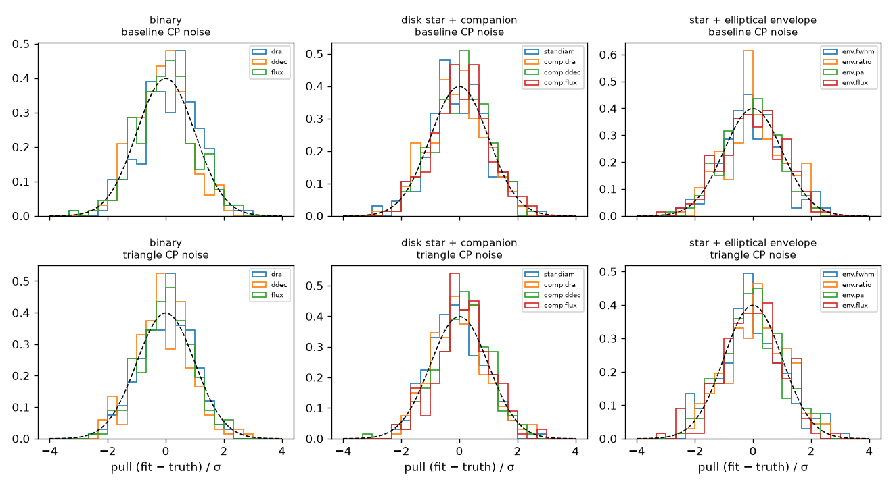
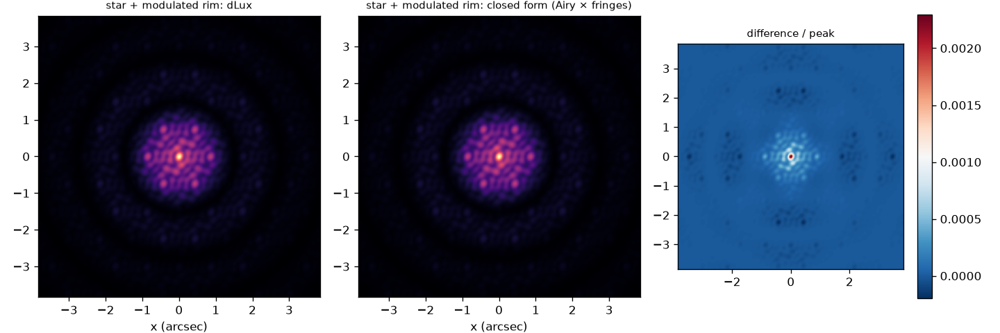

# Results

Generated by `scripts/report.py`; all virgil evaluations in float64.
External packages: PMOIRED 26.10.1 (conventions in
[pmoired_conventions.md](pmoired_conventions.md)).

## Model visibilities (float64, 500 random VLTI-like samples)

| virgil model | our route | max abs(ΔV) |
| --- | --- | --- |
| PointSource | exact phase | 3.5e-15 |
| GaussianDisk | closed form | 2.8e-16 |
| EllipticalGaussian | closed form | 4.8e-16 |
| UniformDisk (12 mas, 4 nulls) | SciPy J1 | 4.4e-16 |
| BinaryModelAngular | exact | 3.6e-16 |
| ModulatedGaussianRim, in-plane azimuth | ring quadrature x Gaussian | 4.9e-16 |
| ModulatedGaussianRim, sky azimuth | (other reading of the docs) | 3.9e-02 |
| GaussianArc (default nodes) | full-circle quadrature | 8.4e-04 |
| Image (7x10 random, orientation) | pixel DFT | 3.4e-16 |
| Resolved dilution | quadrature | 1.2e-15 |

## Long-baseline injection and recovery (4 UTs, 7 hour angles, 6 channels)

| scene | file vs virgil model | max relative error, noise-free fit |
| --- | --- | --- |
| binary | 5.0e-16 | 3.4e-12 |
| disk star + companion | 8.9e-16 | 1.8e-10 |
| star + elliptical envelope | 4.4e-16 | 4.2e-10 |
| star + modulated rim | 5.6e-16 | 3.6e-08 |

### Pulls over 200 noisy realisations (σ(V²) = 0.02, σ(CP) = 1°)

(fit − truth) / σ, with σ from virgil's Laplace covariance. Closure-phase noise is either drawn per baseline (so triangles sharing a baseline are correlated, as in real data) or independently per triangle.

With 200 draws the sampling sd of a mean is 0.07 and of an sd 0.05. virgil whitens closure phases as a correlated group, as they are when formed from baseline phases, so the `baseline` rows test the realistic case; with independent noise per triangle (`triangle`) its errors are slightly conservative.

| scene | CP noise | parameter | mean | sd |
| --- | --- | --- | --- | --- |
| binary | baseline | `dra` | +0.15 | 0.99 |
| binary | baseline | `ddec` | -0.15 | 0.89 |
| binary | baseline | `flux` | -0.01 | 0.98 |
| binary | triangle | `dra` | +0.03 | 0.91 |
| binary | triangle | `ddec` | -0.11 | 0.93 |
| binary | triangle | `flux` | +0.00 | 0.90 |
| disk star + companion | baseline | `star.diam` | -0.03 | 0.99 |
| disk star + companion | baseline | `comp.dra` | -0.09 | 0.96 |
| disk star + companion | baseline | `comp.ddec` | +0.06 | 0.93 |
| disk star + companion | baseline | `comp.flux` | +0.06 | 0.96 |
| disk star + companion | triangle | `star.diam` | -0.09 | 0.90 |
| disk star + companion | triangle | `comp.dra` | -0.00 | 0.93 |
| disk star + companion | triangle | `comp.ddec` | +0.11 | 0.93 |
| disk star + companion | triangle | `comp.flux` | +0.17 | 0.92 |
| star + elliptical envelope | baseline | `env.fwhm` | -0.08 | 1.01 |
| star + elliptical envelope | baseline | `env.ratio` | +0.05 | 0.97 |
| star + elliptical envelope | baseline | `env.pa` | -0.05 | 0.93 |
| star + elliptical envelope | baseline | `env.flux` | -0.01 | 1.04 |
| star + elliptical envelope | triangle | `env.fwhm` | -0.08 | 1.10 |
| star + elliptical envelope | triangle | `env.ratio` | +0.10 | 1.05 |
| star + elliptical envelope | triangle | `env.pa` | -0.01 | 0.99 |
| star + elliptical envelope | triangle | `env.flux` | -0.02 | 1.03 |

## Aperture masking with dLux (7-hole NIRISS-like mask, 4.8 µm, 30 mas pixels)

max abs(ΔV) between the calibrated visibilities (image FT / point-source image FT at the 21 baselines) and the exact scene, for two detector sizes. The two imagers share nothing but the point cloud.

| scene | points | dLux 128 px | analytic 128 px | dLux 256 px | analytic 256 px | dLux vs analytic, 256 px |
| --- | --- | --- | --- | --- | --- | --- |
| binary | 2 | 8.0e-04 | 8.0e-04 | 1.3e-04 | 1.4e-04 | 6.9e-06 |
| disk star + companion | 1537 | 1.9e-03 | 1.9e-03 | 3.1e-04 | 3.3e-04 | 1.8e-05 |
| star + elliptical envelope | 257 | 1.9e-03 | 1.9e-03 | 3.0e-04 | 3.1e-04 | 1.7e-05 |
| star + modulated rim | 3201 | 4.3e-03 | 4.4e-03 | 7.9e-04 | 8.4e-04 | 4.3e-05 |

### virgil fits to the noise-free dLux observables (256 px)

Bias in units of the Laplace σ for realistic errors (σ(CP) = 1°, σ(V²) = 0.02).

| scene | parameter | truth | fit | bias / σ |
| --- | --- | --- | --- | --- |
| binary | `dra` | 124.4 | 124.4 | +0.004 |
| binary | `ddec` | -83.88 | -83.85 | +0.011 |
| binary | `flux` | 0.05 | 0.05001 | +0.003 |
| disk star + companion | `star.diam` | 90 | 90.01 | +0.007 |
| disk star + companion | `comp.dra` | -180 | -180 | +0.004 |
| disk star + companion | `comp.ddec` | 120 | 120 | -0.005 |
| disk star + companion | `comp.flux` | 0.03 | 0.02999 | -0.004 |
| star + elliptical envelope | `env.fwhm` | 160 | 160 | -0.004 |
| star + elliptical envelope | `env.ratio` | 0.5 | 0.4998 | -0.007 |
| star + elliptical envelope | `env.pa` | 60 | 60.04 | +0.022 |
| star + elliptical envelope | `env.flux` | 0.4 | 0.4003 | +0.008 |
| star + modulated rim | `rim.diam` | 240 | 240 | — (see finding 5) |
| star + modulated rim | `rim.fwhm` | 40 | 39.77 | — (see finding 5) |
| star + modulated rim | `rim.inc` | 45 | 44.95 | — (see finding 5) |
| star + modulated rim | `rim.pa` | 30 | 30.09 | — (see finding 5) |
| star + modulated rim | `rim.az_amps` | 0.5 | 0.4993 | — (see finding 5) |
| star + modulated rim | `rim.az_pas` | 120 | 120 | — (see finding 5) |
| star + modulated rim | `rim.flux` | 0.8 | 0.7991 | — (see finding 5) |

_Run time 376 s._
