# Trust

<!-- Generated by scripts/trust.py from trust/graph.yml, trust/ledger.yml and the evidence. Do not edit. -->

- Evidence from github-actions on 2026-10-04T03:34:42+00:00, virgil `ec4cf51530` ([run](https://github.com/benjaminpope/virgil-validation/actions/runs/37174042613))
- Evidence from virgil-ci on 2026-10-04T03:34:49+00:00, virgil `ec4cf51530` ([run](https://github.com/benjaminpope/virgil/actions/runs/37173979477))

Statuses: ✅ trusted 57, ⬜ unchecked 9.

A node is **trusted** when it passes checks against enough distinct strong roots
(mathematics, standards, statistics, literature, or a trusted package) and every
node it is built on is trusted; **stale** when virgil's source under it changed
after the evidence was measured. See [design](design.md).

## Graph

```mermaid
flowchart BT
    classDef done fill:#c8e6c9,stroke:#2e7d32,color:#000
    classDef part fill:#fff3c4,stroke:#b28704,color:#000
    classDef bad fill:#ffcdd2,stroke:#c62828,color:#000
    classDef todo fill:#eeeeee,stroke:#9e9e9e,color:#555,stroke-dasharray: 5 5
    subgraph references["references"]
        n56["crosscheck"]:::done
        n57["crosscheck.sky"]:::done
        n58["crosscheck.limb"]:::done
        n59["crosscheck.nrm"]:::done
        n60["external_bridge"]:::done
        n61["external_bridge.pmoired_models"]:::done
        n62["evidence"]:::done
        n63["pmoired"]:::done
        n64["candid"]:::done
        n65["external_bridge.candid_bridge"]:::done
    end
    subgraph data["data"]
        n0["oifits.read_oifits"]:::done
        n1["oidata.OIData"]:::done
        n2["oidata.find_uv_grid"]:::done
        n3["coverage.vlti_oidata"]:::done
        n4["amigo.load_oi_data"]:::todo
    end
    subgraph models["models"]
        n5["PointSource"]:::done
        n6["GaussianDisk"]:::done
        n7["EllipticalGaussian"]:::done
        n8["UniformDisk"]:::done
        n9["ModulatedGaussianRim"]:::done
        n10["GaussianArc"]:::done
        n11["BinaryModelCartesian"]:::done
        n12["BinaryModelAngular"]:::done
        n13["Image"]:::done
        n14["Image.model_on_grid"]:::done
        n15["Image.from_model"]:::done
        n16["SourceModel.render"]:::done
        n17["Resolved"]:::done
        n18["Rotated"]:::done
        n19["System"]:::done
        n20["GravityDarkenedStar"]:::done
        n21["cvis_limb_darkened_disk"]:::done
        n22["LimbDarkenedDisk"]:::done
        n23["QuadraticLimbDarkenedDisk"]:::done
        n24["SquareRootLimbDarkenedDisk"]:::done
        n25["FlaredDiskGaussian"]:::done
        n26["FlaredDiskHG"]:::done
        n27["FlaredDiskPowerLaw"]:::done
        n28["HarmonixModel"]:::done
        n29["spectra.PowerLaw"]:::done
        n30["spectra.BlackBody"]:::done
        n31["spectra.Tabulated"]:::done
        n55["_elr"]:::done
    end
    subgraph likelihood["likelihood"]
        n32["likelihood.whitened_residuals"]:::done
        n33["likelihood.model_loglike"]:::done
        n34["fitting.fit"]:::done
    end
    subgraph inference["inference"]
        n35["inference.laplace_cov"]:::done
        n36["grid_fit.likelihood_grid"]:::done
        n37["grid_fit.optimized_flux_grid"]:::done
        n38["grid_fit.laplace_flux_uncertainty_grid"]:::done
        n39["limits.nsigma"]:::done
        n40["limits.absil_limits"]:::done
        n41["limits.ruffio_upperlimit"]:::done
        n42["likelihood.numpyro_model"]:::todo
    end
    subgraph imaging["imaging"]
        n43["imaging.dirty_image"]:::done
        n44["imaging.beam"]:::done
        n45["imaging.nyquist_pixel_scale"]:::done
        n46["imaging.field_of_view"]:::done
        n47["imaging.convolve_beam"]:::done
        n48["imaging.TSV"]:::todo
        n49["imaging.TV"]:::todo
        n50["imaging.MaxEntropy"]:::todo
        n51["imaging.Laplacian"]:::todo
        n52["imaging.StarletL1"]:::todo
        n53["imaging.LogSum"]:::todo
        n54["imaging.l_curve"]:::todo
    end
    n0 --> n1
    n1 --> n4
    n13 --> n14
    n13 --> n15
    n5 --> n19
    n6 --> n19
    n8 --> n19
    n55 --> n20
    n21 --> n22
    n21 --> n23
    n21 --> n24
    n1 --> n32
    n32 --> n33
    n33 --> n34
    n33 --> n35
    n33 --> n36
    n33 --> n37
    n33 --> n38
    n33 --> n40
    n39 --> n40
    n37 --> n41
    n38 --> n41
    n33 --> n42
    n1 --> n43
    n1 --> n44
    n34 --> n54
```

## Objects

| object | status | strong roots (needed) | weak | tests | evidence on virgil |
| --- | --- | --- | --- | --- | --- |
| `virgil.oifits.read_oifits` | ✅ trusted | mathematics, pmoired, standards (2) |  | 16 | ec4cf51 |
| `virgil.oidata.OIData` | ✅ trusted | mathematics, standards (1) | self-consistency | 16 | ec4cf51 |
| `virgil.oidata.find_uv_grid` | ✅ trusted | mathematics (1) |  | 3 | ec4cf51 |
| `virgil.coverage.vlti_oidata` | ✅ trusted | standards (1) |  | 1 | ec4cf51 |
| `virgil.amigo.load_oi_data` | ⬜ unchecked | — (1) |  | 0 |  |
| `virgil.models.PointSource` | ✅ trusted | candid, mathematics, pmoired (1) |  | 13 | ec4cf51 |
| `virgil.models.GaussianDisk` | ✅ trusted | mathematics, pmoired (1) |  | 13 | ec4cf51 |
| `virgil.models.EllipticalGaussian` | ✅ trusted | mathematics, pmoired (1) |  | 14 | ec4cf51 |
| `virgil.models.UniformDisk` | ✅ trusted | candid, mathematics, pmoired (1) |  | 18 | ec4cf51 |
| `virgil.models.ModulatedGaussianRim` | ✅ trusted | mathematics, pmoired (2) |  | 17 | ec4cf51 |
| `virgil.models.GaussianArc` | ✅ trusted | mathematics (1) |  | 4 | ec4cf51 |
| `virgil.models.BinaryModelCartesian` | ✅ trusted | mathematics, pmoired (2) |  | 4 | ec4cf51 |
| `virgil.models.BinaryModelAngular` | ✅ trusted | mathematics, pmoired (1) |  | 3 | ec4cf51 |
| `virgil.models.Image` | ✅ trusted | mathematics, standards (1) |  | 4 | ec4cf51 |
| `virgil.models.Image.model_on_grid` | ✅ trusted | mathematics (1) | self-consistency | 9 | ec4cf51 |
| `virgil.models.Image.from_model` | ✅ trusted | mathematics (1) |  | 1 | ec4cf51 |
| `virgil.models.SourceModel.render` | ✅ trusted | mathematics, standards (1) | self-consistency | 18 | ec4cf51 |
| `virgil.models.Resolved` | ✅ trusted | mathematics, pmoired (1) |  | 3 | ec4cf51 |
| `virgil.models.Rotated` | ✅ trusted | mathematics (1) |  | 4 | ec4cf51 |
| `virgil.models.System` | ✅ trusted | candid, dlux, mathematics, pmoired, standards (1) |  | 26 | ec4cf51 |
| `virgil.models.GravityDarkenedStar` | ✅ trusted | golden:dholakia, mathematics (1) |  | 3 | ec4cf51 |
| `virgil.models.cvis_limb_darkened_disk` | ✅ trusted | mathematics (1) |  | 5 | ec4cf51 |
| `virgil.models.LimbDarkenedDisk` | ✅ trusted | mathematics (1) |  | 22 | ec4cf51 |
| `virgil.models.QuadraticLimbDarkenedDisk` | ✅ trusted | literature, mathematics, pmoired, standards (1) |  | 11 | ec4cf51 |
| `virgil.models.SquareRootLimbDarkenedDisk` | ✅ trusted | literature, mathematics, pmoired (1) |  | 8 | ec4cf51 |
| `virgil.models.FlaredDiskGaussian` | ✅ trusted | mathematics (1) |  | 4 | ec4cf51 |
| `virgil.models.FlaredDiskHG` | ✅ trusted | mathematics (1) |  | 5 | ec4cf51 |
| `virgil.models.FlaredDiskPowerLaw` | ✅ trusted | mathematics (1) |  | 5 | ec4cf51 |
| `virgil.models.HarmonixModel` | ✅ trusted | mathematics (1) | self-consistency | 4 | ec4cf51 |
| `virgil.spectra.PowerLaw` | ✅ trusted | mathematics (1) |  | 4 | ec4cf51 |
| `virgil.spectra.BlackBody` | ✅ trusted | mathematics (1) |  | 5 | ec4cf51 |
| `virgil.spectra.Tabulated` | ✅ trusted | mathematics (1) |  | 2 | ec4cf51 |
| `virgil.likelihood.whitened_residuals` | ✅ trusted | candid, mathematics, statistics (1) | self-consistency | 26 | ec4cf51 |
| `virgil.likelihood.model_loglike` | ✅ trusted | candid, mathematics (1) | self-consistency | 10 | ec4cf51 |
| `virgil.fitting.fit` | ✅ trusted | candid, dlux, mathematics, pmoired, statistics (1) | self-consistency | 38 | ec4cf51 |
| `virgil.inference.laplace_cov` | ✅ trusted | candid, mathematics, pmoired, statistics (1) | self-consistency | 30 | ec4cf51 |
| `virgil.grid_fit.likelihood_grid` | ✅ trusted | candid, mathematics (2) |  | 4 | ec4cf51 |
| `virgil.grid_fit.optimized_flux_grid` | ✅ trusted | mathematics, statistics (1) |  | 3 | ec4cf51 |
| `virgil.grid_fit.laplace_flux_uncertainty_grid` | ✅ trusted | mathematics, statistics (1) |  | 3 | ec4cf51 |
| `virgil.limits.nsigma` | ✅ trusted | candid, mathematics (2) |  | 8 | ec4cf51 |
| `virgil.limits.absil_limits` | ✅ trusted | candid, mathematics (2) |  | 4 | ec4cf51 |
| `virgil.limits.ruffio_upperlimit` | ✅ trusted | mathematics (1) |  | 20 | ec4cf51 |
| `virgil.likelihood.numpyro_model` | ⬜ unchecked | — (1) |  | 0 |  |
| `virgil.imaging.dirty_image` | ✅ trusted | mathematics (1) |  | 1 | ec4cf51 |
| `virgil.imaging.beam` | ✅ trusted | mathematics (1) |  | 4 | ec4cf51 |
| `virgil.imaging.nyquist_pixel_scale` | ✅ trusted | mathematics (1) |  | 1 | ec4cf51 |
| `virgil.imaging.field_of_view` | ✅ trusted | mathematics (1) |  | 1 | ec4cf51 |
| `virgil.imaging.convolve_beam` | ✅ trusted | mathematics (1) |  | 3 | ec4cf51 |
| `virgil.imaging.TSV` | ⬜ unchecked | — (1) |  | 0 |  |
| `virgil.imaging.TV` | ⬜ unchecked | — (1) |  | 0 |  |
| `virgil.imaging.MaxEntropy` | ⬜ unchecked | — (1) |  | 0 |  |
| `virgil.imaging.Laplacian` | ⬜ unchecked | — (1) |  | 0 |  |
| `virgil.imaging.StarletL1` | ⬜ unchecked | — (1) |  | 0 |  |
| `virgil.imaging.LogSum` | ⬜ unchecked | — (1) |  | 0 |  |
| `virgil.imaging.l_curve` | ⬜ unchecked | — (1) |  | 0 |  |
| `virgil._elr` | ✅ trusted | golden:dholakia, mathematics (1) |  | 22 | ec4cf51 |
| `crosscheck` | ✅ trusted | standards (1) |  | 1 | ec4cf51 |
| `crosscheck.sky` | ✅ trusted | mathematics (1) |  | 2 | ec4cf51 |
| `crosscheck.limb` | ✅ trusted | literature, mathematics (1) |  | 14 | ec4cf51 |
| `crosscheck.nrm` | ✅ trusted | dlux, mathematics (1) |  | 6 | ec4cf51 |
| `external_bridge` | ✅ trusted | standards (1) |  | 1 | ec4cf51 |
| `external_bridge.pmoired_models` | ✅ trusted | mathematics, pmoired (1) |  | 15 | ec4cf51 |
| `evidence` | ✅ trusted | standards (1) |  | 4 | ec4cf51 |
| `pmoired` | ✅ trusted | mathematics (1) |  | 5 | ec4cf51 |
| `candid` | ✅ trusted | mathematics (1) |  | 2 | ec4cf51 |
| `external_bridge.candid_bridge` | ✅ trusted | candid, mathematics (1) |  | 1 | ec4cf51 |

## Pipelines

End-to-end chains, validated when their own evidence passes and every step is trusted.

| pipeline | status | roots | tests | steps not yet trusted |
| --- | --- | --- | --- | --- |
| **synthetic-vlti-fit**: Simulated VLTI data, OIFITS to fitted parameters and uncertainties | ✅ validated | mathematics, statistics | 13 | — |
| **dlux-masking-fit**: Aperture-masking images from dLux, calibrated and fitted | ✅ validated | dlux | 4 | — |
| **pmoired-identical-fits**: The same files fitted by virgil and PMOIRED | ✅ validated | pmoired, statistics | 8 | — |
| **rml-imaging**: Regularised image reconstruction against eht-imaging or MPoL on the same data | ⬜ planned | — | 0 | `virgil.imaging.TSV`, `virgil.imaging.MaxEntropy` |
| **published-binary**: Reproduce published binary detections from the authors' archival data | ⬜ planned | — | 0 | — |

## Ledger

Every mismatch found, and its ruling: `virgil`, `external:<package>`, `definition` or `crosscheck` (our own code).

| id | ruling | status | finding | referee | links |
| --- | --- | --- | --- | --- | --- |
| F1 | virgil | fixed | ModulatedGaussianRim modulation azimuth is in-plane, not on-sky | mathematics (ring quadrature, both readings) | [134](https://github.com/benjaminpope/virgil/pull/134) |
| F2 | virgil | fixed | GaussianArc truncated its arc-length weight at ±3.5σ | mathematics (full-circle quadrature) | [134](https://github.com/benjaminpope/virgil/pull/134) |
| F3 | virgil | fixed | OIData.uv_grid documented as automatic but set only for AMIGO records | mathematics (lattice transform against a direct sum) | [134](https://github.com/benjaminpope/virgil/pull/134) |
| F4 | definition | documented | Image.from_model's brightness floor adds ~1e-5 of flux on large fields | mathematics (Gaussian transform) |  |
| F5 | virgil | fixed | laplace_cov failed with array-valued parameters | mathematics (finite-difference Hessian, in virgil#135); statistics (rim pulls) | [135](https://github.com/benjaminpope/virgil/pull/135) |
| F6 | virgil | fixed | fit started at an exact zero-residual optimum reported non-convergence | mathematics (chi-squared at the start is zero) | [144](https://github.com/benjaminpope/virgil/pull/144) |
| F7 | virgil | fixed | .expand()ed priors switched fit from LM to L-BFGS | self-consistency (equivalent priors must choose the same method) | [142](https://github.com/benjaminpope/virgil/pull/142) |
| F8 | virgil | fixed | OIData crashed when every closure phase was flagged | standards (the same V² without OI_T3) | [155](https://github.com/benjaminpope/virgil/pull/155) [158](https://github.com/benjaminpope/virgil/pull/158) [160](https://github.com/benjaminpope/virgil/pull/160) |
| F9 | virgil | fixed | reference_flux returns every Tabulated node, not the documented mean | mathematics (Tabulated documents its reference flux as the node mean) | [163](https://github.com/benjaminpope/virgil/pull/163) |
| D1 | definition | documented | ModulatedGaussianRim blurs in the rim plane (changed by virgil#139) | mathematics (in-plane blur transform); PMOIRED (blurred-ring profile, 1e-9) | [139](https://github.com/benjaminpope/virgil/pull/139) |
| D2 | definition | documented | Modulated rims differ between virgil and PMOIRED (blurred modulated ring vs modulated profile) | mathematics (our quadrature of each definition) |  |
| D3 | definition | documented | PMOIRED treats closure phases as independent; virgil whitens them as a correlated group | statistics (200-draw pulls with both noise models) |  |
| D4 | definition | documented | PMOIRED reports uncertainties scaled by sqrt(reduced chi-squared) | PMOIRED's documentation (normalized uncertainties) |  |
| D5 | definition | documented | CANDID's closure-phase residual is the plain phase difference; virgil's is the chord 2 sin(delta/2) | mathematics (both chi-squareds computed independently); equal on V2-only files to 1e-7 |  |
| P1 | external:pmoired | to-raise | PMOIRED setupFit(auto=True) gives NaN models on files with few channels | mathematics (finite models expected) |  |
| P2 | external:pmoired | to-raise | PMOIRED's default ring sampling is not its documented Nr = 100 | mathematics (two-Airy annulus) |  |
| P3 | external:pmoired | to-raise | PMOIRED's rings stop at ~1e-4 precision beyond 30 samples per baseline | mathematics (two-Airy annulus) |  |
| C1 | crosscheck | fixed | Our PMOIRED parameter mapping had the wrong sign of d(ratio)/d(incl) | PMOIRED and virgil correlations (they agreed once fixed) | [11](https://github.com/benjaminpope/virgil-validation/pull/11) |
| P4 | external:candid | to-raise | CANDID's Absil detection limits are ~1 % low against its own criterion (bracketing by factors of 1.4, then linear interpolation) | mathematics (CANDID's criterion solved exactly with Brent's method) |  |
